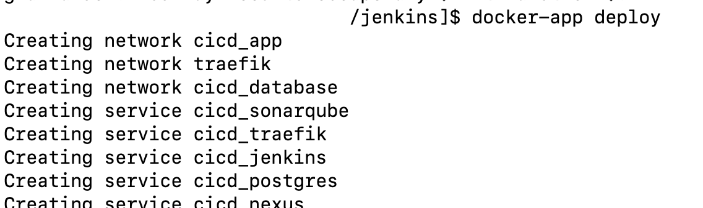
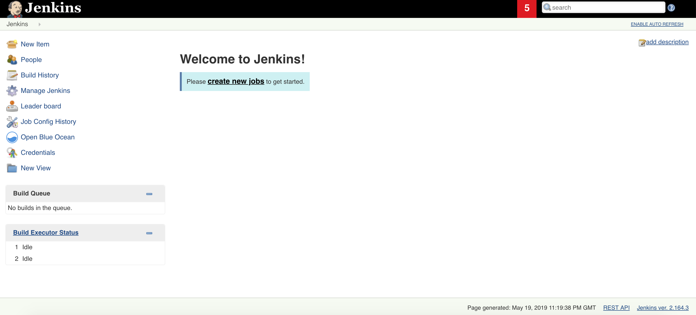
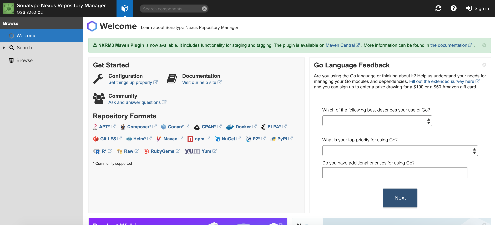
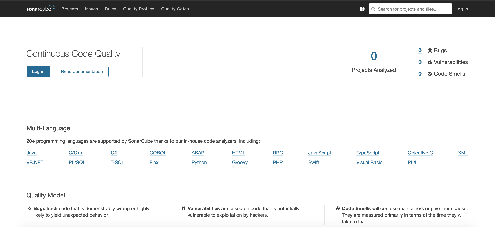

# **CI/CD Suite Docker Application Package**

## **Prerequisite**
- [x] Docker: 18.09.1
- [x] Docker Compose: 1.23.2
- [x] Docker Swarm enabled (docker swarm init)
- [x] [Docker APP](https://github.com/docker/app)
  - [x] [Download Docker App from here for your Environment](https://github.com/docker/app/releases)

<span style="color:green">***NOTE:*** docker-app will be available in main Docker bundle in future release.</span>

## **Add entry in /etc/hosts files**
```
127.0.0.1       test.company.com
```

## **Initialize Docker Swarm**
```
docker swarm init
```

## **Deploy Docker Registry**
```
docker run -d -p 5000:5000 --name registry registry:2
```

## **Tools**
- [x] [Jenkins](http://test.company.com/jenkins/)
  - **Ports:** 8080, 443, 50000
- [x] [Nexus](http://test.company.com/nexus/)
  - **Ports:** 8081
- [x] [Sonarqube](http://test.company.com/sonarqube/about)
  - **Ports:** 9000
- [x] Postgres
  - **Ports:** 5432
- [x] [Traefik](http://test.company.com:8080/dashboard/)
  - **Ports:** 8080, 443

## **Build and Publish Jenkins Master Image**
```
docker build -t localhost:5000/jenkins:latest jenkins/
docker push localhost:5000/jenkins:latest
```

## **Build and Publish Jenkins Build Agent Image**
```
docker build -t localhost:5000/jenkinsagent:latest jenkinsagent/
docker push localhost:5000/jenkinsagent:latest
```

## **Create Docker Secret**
```
echo "admin" | docker secret create jenkins_username -
echo "admin" | docker secret create jenkins_password -
echo "admin" | docker secret create pg_password -
```

<span style="color:red">***NOTE:*** PLEASE DO NOT USE ADMIN/ADMIN as your credentials.</span>

## **Deploy Docker Application Package**
```
docker-app deploy
```


## **Check Docker Service Status**
```
docker service ls
```


## **Open Traefik Dashboard in Browser**
```
open http://test.company.com:8080/
```


## **Open Jenkins Master in Browser**
```
open http://test.company.com/jenkins/
```


## **Open Nexus Repository Manager in Browser**
```
open http://test.company.com/nexus
```

<span style="color:blue">***NOTE:*** Default credential admin/admin123.</span>

## **Open Sonarqube in Browser**
```
open http://test.company.com/sonarqube/
```

<span style="color:blue">***NOTE:*** Default credential admin/admin.</span>

## **Resources**
* [Pipeline as a Code using Jenkins 2](https://medium.com/@maxy_ermayank/pipeline-as-a-code-using-jenkins-2-aa872c6ecdce)
* [Useful Docker Commands and Aliases](https://medium.com/faun/useful-docker-commands-and-aliases-9ea79191832f)
* [Official Jenkins Docker image](https://github.com/jenkinsci/docker/blob/master/README.md)